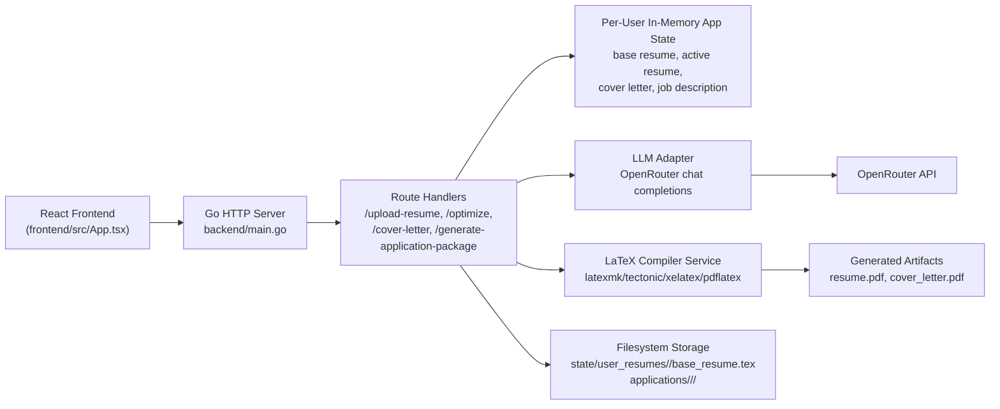
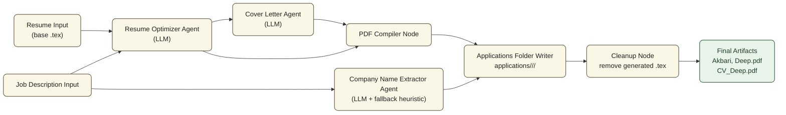

# Haraesume - AI-Powered Resume Optimizer

A full-stack web application that optimizes LaTeX resumes for specific job descriptions using AI and generates tailored cover letters.


## Features

- LaTeX Resume Upload - Drag-and-drop your `.tex` resume
- AI-Powered Optimization - Tailors your resume to match job descriptions
- Smart Skill Targeting - Prioritizes a small set of missing high-value technical skills
- Cover Letter Generation - Creates personalized cover letters
- PDF Export - Compiles optimized LaTeX to downloadable PDF
- ATS-Friendly - Keeps formatting compatible with applicant tracking systems
- Persistent Per-User Base Resume - each authenticated user uploads once, then reuses their own baseline resume

## Tech Stack

| Layer | Technology |
|-------|------------|
| Backend | Go (net/http) |
| Frontend | React, TypeScript, Vite, TailwindCSS |
| LLM | OpenRouter API (Claude) |
| PDF | TeX Live (pdflatex) |

## Project Structure

```text
haraesume/
├── backend/                 # Go API server
│   ├── go.mod
│   └── main.go              # Routes, LLM integration, PDF compilation
├── frontend/                # React SPA
│   ├── package.json
│   ├── vite.config.ts
│   └── src/
│       ├── App.tsx          # 4-step wizard UI
│       └── index.css        # Theme styles
└── sample_resume.tex        # Test resume
```

## Backend Architecture



## AI Agent Pipeline 



## Prerequisites

- Go (1.22+)
- Node.js (20+)
- TeX Live (for `pdflatex`)
- OpenRouter API key
- Auth0 tenant with:
  - One SPA application (for frontend login)
  - One custom API (for audience/access tokens)

## Quick Start

### 1. Clone & Setup

```bash
git clone https://github.com/Ackberry/haraesume.git
cd haraesume
```

### 2. Start Backend

```bash
cd backend
export OPENROUTER_API_KEY="your-openrouter-api-key"
export AUTH_PROVIDER="auth0"
export AUTH0_DOMAIN="your-tenant.us.auth0.com"
export AUTH0_ISSUER_BASE_URL="https://your-tenant.us.auth0.com"
export AUTH0_AUDIENCE="https://api.haraesume.com"
go run .
# Server: http://localhost:3001
```

### 3. Start Frontend

```bash
cd frontend
npm install
export VITE_AUTH0_DOMAIN="your-tenant.us.auth0.com"
export VITE_AUTH0_CLIENT_ID="your-auth0-spa-client-id"
export VITE_AUTH0_AUDIENCE="https://api.haraesume.com"
export VITE_AUTH0_REDIRECT_URI="http://localhost:5173"
npm run dev
# App: http://localhost:5173
```

### 4. Use the App

1. Open http://localhost:5173
2. Sign in (or create account) via Auth0
3. Upload a `.tex` resume (use `sample_resume.tex` to test)
4. Paste the job description
5. Click **Optimize Resume**
6. Download PDF or generate a cover letter

After the first upload, the backend persists your base resume for that authenticated user. On later sessions, that same user can go straight to the job description step.

## API Endpoints

| Endpoint | Method | Description |
|----------|--------|-------------|
| `/health` | GET | Health check |
| `/api/resume-status` | GET | Whether the current authenticated user has a persisted base resume |
| `/api/upload-resume` | POST | Upload LaTeX file (multipart) |
| `/api/job-description` | POST | Set job description |
| `/api/optimize` | POST | Optimize resume with AI |
| `/api/cover-letter` | POST | Generate formal cover letter LaTeX |
| `/api/generate-application-package` | POST | Generate resume + cover letter, store in `applications/<user_hash>/<company>/`, keep PDFs, delete `.tex` |
| `/api/generate-cover-letter-pdf` | POST | Compile generated cover letter to PDF |
| `/api/generate-pdf` | POST | Compile to PDF (base64) |

## Environment Variables

| Variable | Description |
|----------|-------------|
| `OPENROUTER_API_KEY` | Your OpenRouter API key |
| `OPENROUTER_MODEL` | Optional model override for backend/agents |
| `AUTH_PROVIDER` | Set to `auth0` to enforce Auth0 JWT auth on `/api/*` routes |
| `AUTH0_DOMAIN` | Auth0 tenant domain (example: `your-tenant.us.auth0.com`) |
| `AUTH0_ISSUER_BASE_URL` | Auth0 issuer URL (example: `https://your-tenant.us.auth0.com`) |
| `AUTH0_AUDIENCE` | Auth0 API Identifier used as JWT audience |
| `AUTH0_CLIENT_ID` | Optional backend M2M use; not required for frontend user auth |
| `AUTH0_CLIENT_SECRET` | Optional backend M2M use; keep secret server-side only |
| `RESUME_STORE_PATH` | Optional directory for persisted per-user resumes (default: `state/user_resumes`) |
| `APPLICATIONS_ROOT_PATH` | Optional absolute/relative override for output root (default: `<repo>/applications`) |
| `VITE_AUTH0_DOMAIN` | Auth0 tenant domain for frontend |
| `VITE_AUTH0_CLIENT_ID` | Auth0 SPA application client ID |
| `VITE_AUTH0_AUDIENCE` | Audience/Identifier for your custom Auth0 API |
| `VITE_AUTH0_REDIRECT_URI` | Frontend callback URL after Auth0 login |

You can keep a single root `.env` at `haraesume/.env`.

- Frontend reads root env via `frontend/vite.config.ts` (`envDir: '..'`)
- Backend auto-loads `.env` from either `backend/.env` or root `../.env`

Auth0 app settings should include:

- Allowed Callback URLs: `http://localhost:5173`
- Allowed Logout URLs: `http://localhost:5173`
- Allowed Web Origins: `http://localhost:5173`

Resume upload is `.tex` only. PDF is generated as output via `/api/generate-pdf`.

### Railway Storage Notes

- Railway ephemeral disk is cleared on redeploy/restart unless you use a volume.
- Mount a Railway volume (example mount path: `/data`).
- Set:
  - `RESUME_STORE_PATH=/data/user_resumes`
  - `APPLICATIONS_ROOT_PATH=/data/applications`
- If these vars are unset and `/data` exists, the backend now defaults to:
  - `/data/user_resumes` for base resumes
  - `/data/applications` for generated application artifacts
- With that setup:
  - New authenticated users start with no base resume.
  - After upload, each user keeps their own base resume across restarts/redeploys.

## LangGraph Resume Match Agents

This repo now includes a dedicated LangChain + LangGraph multi-node agent flow for resume checking and job matching:

- Location: `backend/agents/`
- Install deps: `pip install -r backend/agents/requirements.txt`
- Entry point:
  - `cd backend`
  - `python -m agents --resume-file ../sample_resume.tex --jd-file ./job_description.txt`

### Agent Tools

- `extract_keywords` - keyword extraction for resume/JD text
- `ats_lint_resume` - ATS format and completeness checks
- `parse_job_requirements` - required/preferred skill extraction
- `compute_match_score` - required/preferred/overall match scores
- `identify_skill_gaps` - matched vs missing skill detection

### Graph Nodes and Edges

1. `validate` -> checks required inputs
2. `resume_check` -> ATS lint + resume keywords
3. `job_analysis` -> JD requirements + keywords
4. `matching` -> coverage scoring + gap detection
5. `recommendations` -> actionable improvements
6. `finalize` -> final report synthesis

Edges:
- `START -> validate`
- `validate -> resume_check` (if valid) else `validate -> finalize`
- `resume_check -> job_analysis -> matching -> recommendations -> finalize -> END`

## Development

### Backend

```bash
cd backend
go test ./...
go run .
```

### Frontend

```bash
cd frontend
npm run dev
npm run build
npm run preview
```

## License

MIT
